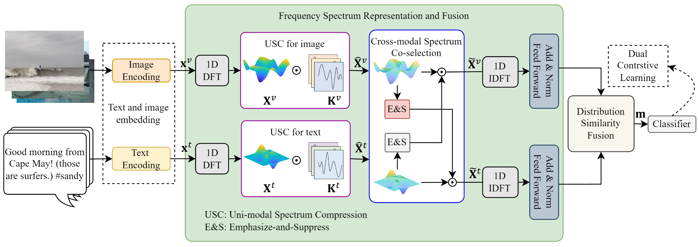

# FSRU
This is the PyTorch implementation of AAAI 2024 paper "Frequency Spectrum is More Effective 
for Multimodal Representation and Fusion: A Multimodal Spectrum Rumor Detector".

by _AN Lao, Qi Zhang, Chongyang Shi, Longbing Cao, Kun Yi, Liang Hu, Duoqian Miao_



## Dataset
* [Weibo](https://drive.google.com/file/d/14VQ7EWPiFeGzxp3XC2DeEHi-BEisDINn/view)
* [Twitter (mediaeval)](https://github.com/MKLab-ITI/image-verification-corpus/tree/master/mediaeval2015)

## Dependencies
This code requires the following:
* python == 3.9
* torch == 2.1.1
* torchvision == 0.16.1
* numpy == 1.26.2
* pandas == 2.1.1
* scipy == 1.11.4
* scikit-learn == 1.3.2
* timm == 0.9.12

## Running the experiments
```shell
python main_kfold.py
```

